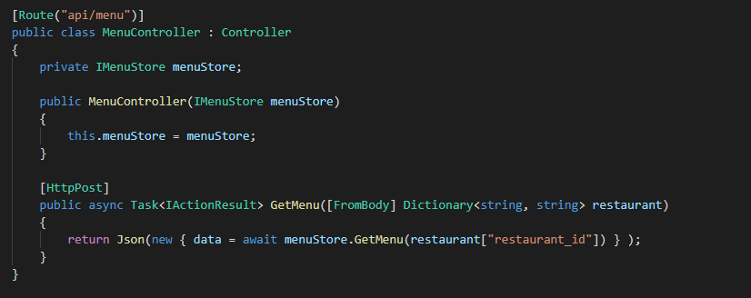
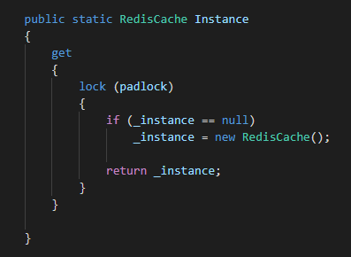
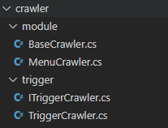
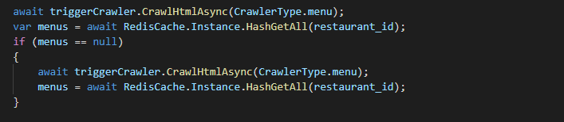

# REDIS CACHE PRACTICE

Redis (inmemory db) 를 이용하여, 학식 메뉴를 효율적으로 응답해주는 API 서버입니다.

## Introduction
특정 식당의 식단 요청에 대한 데이터를 크롤링해온 후, Redis 에 저장

이 후, 요청에 대한 데이터는 Redis Cache 에 있는 데이터를 반환해줌으로써, 크롤링하는 비용을 아끼고, low latency 를 유지할 수 있다.

### FOCUS
- Low Latency : 식단을 크롤링해오는 작업은 Latency 를 높일 수 밖에 없다. 하여, 첫 요청일 때에만 데이터를 크롤링해오고, 이 후 데이터는 Redis Cache (Inmemory DB) 를 통하여, 빠르게 가져와 Low Latency 를 유지합니다.

- Efficient Memory Management : 현재 프로젝트의 경우, 저장하는 데이터가 많지 않지만, 실제 솔루션들의 상황에서 보았을 때, Redis Cache 를 이용할 때에는 효율적인 메모리 관리가 필요하다. 하여, Singleton Pattern 을 이용하여, 첫 사용 시, 객체를 생성하고, 이를 공유하는 방식으로 Redis Cache Class 를 구현하였습니다.

- Clean Architecture
미래 프로젝트의 확장 가능성을 생각하여, Layer 분리, Module화 및 Trigger Layer 를 구축하였습니다.
자세한 내용은 아래 Implment 탭에서 설명하겠습니다

*** 

## Implement
각 Layer 별로 구현한 내용을 간단하게 소개하겠습니다.

### Controller

모든 비즈니스 로직을 Service Layer 인 menuStore 에게 delegate 한 모습입니다.

### Redis

Redis Cache Class 내부 중, Singleton Pattern 이 적용된 Instance Method 부분입니다.
lock 을 통해 동시에 해당 객체를 접근하여, 만들 수 없게 하였습니다.

### Crawler Service

Crawler Service 의 경우, 현재에는 MenuCrawler 한 종류밖에 존재하지 않지만, 이 후, 확장성을 생각해보았을 때,
BaseCrawler 를 기반으로 모듈화된 Module Crawler 들과 이를 Trigger 해주는 Trigger 로 분리하였습니다.
실제 Store 에서는 Trigger 의 Interface 를 이용하여, Layer 간 소통합니다.

### Store Service

MenuController 가 역할을 위임한 Service 로, Redis Cache 에 원하는 데이터가 있다면 바로 반환, 없다면 Crawler 서비스를 통해서 반환해주는 역할을 합니다.